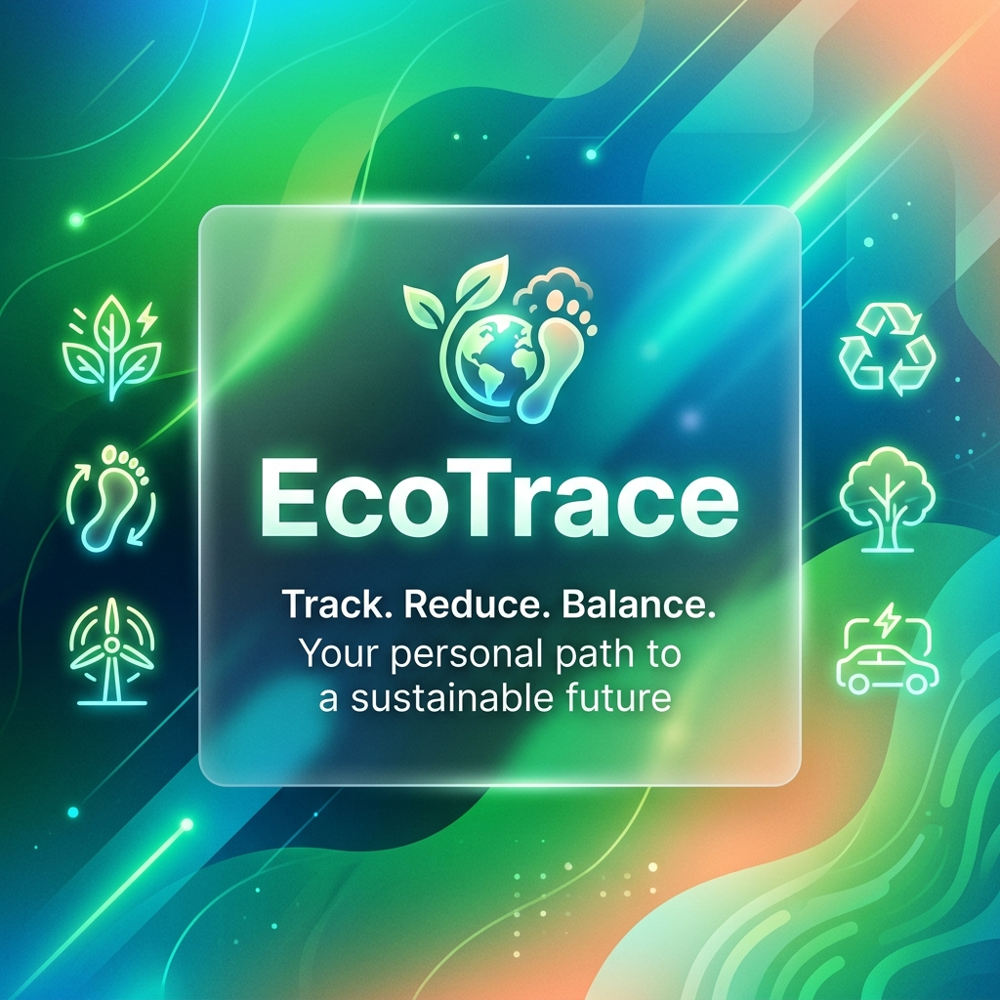
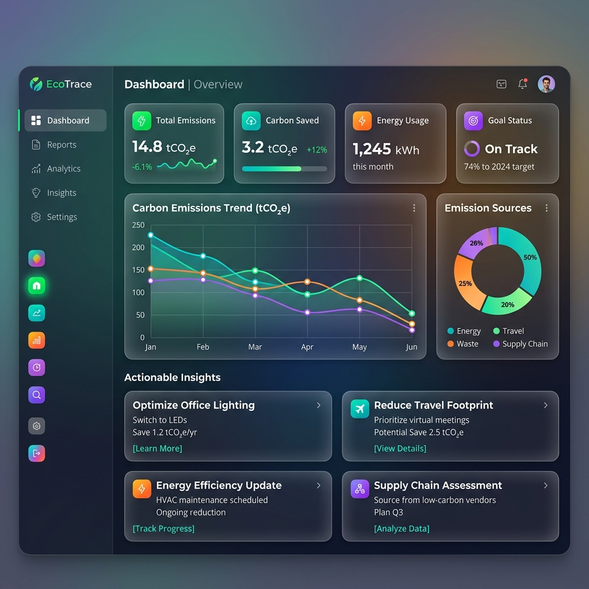

# EcoTrace – A Concierge‑Agent for Personal Carbon‑Footprint Management

## Problem Statement
Environmental sustainability is a growing concern, and individuals often lack easy, actionable insight into their personal carbon footprint and habits. Existing tools are fragmented, require manual data entry, or do not provide real‑time guidance.

## Solution Overview
**EcoTrace** is a Flask‑based web application that uses the **aentigrity CLI** as an intelligent agent to answer sustainability queries, suggest eco‑friendly habits, and track carbon‑footprint data. The backend enforces guard‑rails, logs security events, and falls back to a simulated response when the CLI is unavailable.

## Architecture
- **Frontend**: Modern HTML/CSS/JavaScript with glassmorphism, custom scrollbars, and smooth micro‑animations for a premium UI.
- **Backend (Flask)**:
  - **GraphWorkflowEngine** – lightweight graph‑based routing (pre‑screen ➜ LLM ➜ post‑process).
  - **Guard‑rails** – disallow injection phrases and limit message length.
  - **HITL queue** – flagged messages are stored for manual review.
  - **Endpoints**:
    - `POST /api/agent/chat` – chat with the agent.
    - `POST /api/agent/trigger` – Pub/Sub style trigger.
    - `GET /api/agent/security‑logs` – view blocked messages.
    - Habit & footprint CRUD APIs.


## Problem Statement
Environmental sustainability is a growing concern, and individuals often lack easy, actionable insight into their personal carbon footprint and habits. Existing tools are fragmented, require manual data entry, or do not provide real‑time guidance.

## Solution Overview
**EcoTrace** is a Flask‑based web application that uses Google Gemini (or a simulated backend) to answer sustainability queries, suggest eco‑friendly habits, and track carbon‑footprint data. It features a premium glassmorphism UI with micro‑animations, guard‑rails, and optional HITL review.

## Architecture
- **Frontend**: Modern HTML/CSS/JavaScript with glassmorphism, custom scrollbars, and smooth micro‑animations.
- **Backend (Flask)**:
  - Graph workflow engine for routing.
  - Guard‑rails to block unsafe inputs.
  - Endpoints for chat, footprint CRUD, and security logs.
- **Environment**: `python-dotenv` for configuration.
- **Metrics**: Prometheus exporter.



## Setup & Installation
1. Clone the repository
   ```bash
   git clone <repo-url>
   cd AIAgents/Project
   ```
2. Create a virtual environment
   ```bash
   python -m venv venv
   .\venv\Scripts\activate
   ```
3. Install dependencies
   ```bash
   pip install -r requirements.txt
   ```
4. (Optional) Create a `.env` file for custom configuration.
5. Run the server
   ```bash
   python app.py
   ```
   The app will be available at `http://localhost:8080`.

## Usage
- Open the URL in a browser to interact with the chatbot.
- Use API endpoints for programmatic access (see `README_API.md`).

## Deployment (Optional)
Containerise with Docker and deploy to Google Cloud Run, AWS Fargate, etc.

## License
---
*All sensitive credentials are loaded from environment variables; no API keys are hard‑coded.*
